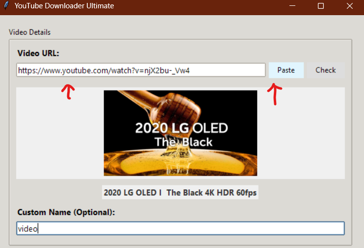
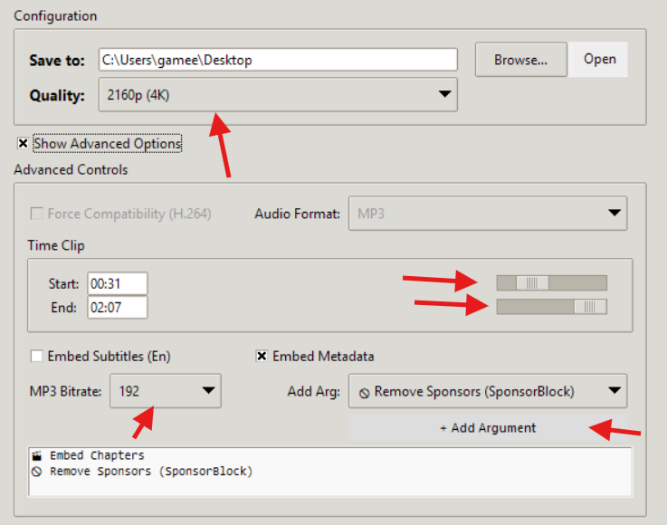
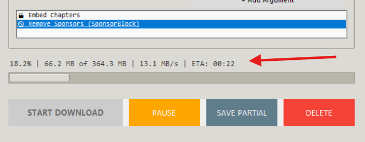
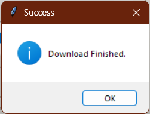

# 📺 Gameel YT Downloader

A robust, resume-capable YouTube downloader built with **Python** and **Tkinter**. This application provides a modern GUI wrapper for `yt-dlp` and `ffmpeg`, offering features like 4K video merging, exact time clipping, and smart file collision detection.

<p align="center">
    
</p>

---


## 💾 How to Download

**For most users:**

1. **Go to the [Releases](https://github.com/gameelaj/Gameel-YT-Downloader/releases/tag/v1.0) page.**
2. Download the zip folder.
3. Extract the files and run the gameelydownloader.exe

---

## 🛠️ For Developers

If you want to run from source or contribute:

1. **Clone or Download** this repository:
    ```bash
    git clone https://github.com/gameelalbazeli/GameelYTDownloader.git
    ```
    Or download the ZIP and extract it.

2. **Install Requirements:**
    ```bash
    pip install -r requirements.txt
    ```

3. **Run the App:**
    ```bash
    python src/main.py
    ```

4. *(Optional)*: For Windows, you can build a standalone EXE using PyInstaller:
    ```bash
    pyinstaller --onefile --windowed src/main.py
    ```

---

## 🚀 How to Use

Follow this visual guide to see the application in action:

### Step 1: Paste your Link
Copy the URL of the YouTube video you wish to download and paste it into the URL field.



### Step 2: Set your Preferences
Select your desired resolution (up to 4K). If you only need a specific segment, toggle the **Clip** option and enter your Start/End times.



### Step 3: Download & Monitor
Click the **Download** button. You can monitor the progress bar and real-time status updates in the console area of the GUI.



### Step 4: Access your Files
Once finished, the video is automatically merged and saved to your selected output folder.



---

## 🧠 The Development Journey

### Why This Project?
While `yt-dlp` is a powerful command-line engine, its lack of a native interface makes it inaccessible for many users. I built this to bridge that gap, moving beyond a simple downloader to a tool that manages the entire media asset lifecycle—from specific time-clipping to intelligent resuming.

### Engineering Challenges & Solutions

- **The "Whack-a-Mole" Version Problem:** UI library updates often caused crashes due to renamed attributes. I refactored the UI to use a **Universal Property** approach, utilizing pure strings for properties to make the code version-proof.
- **Asynchronous UI & Threading:** Downloading 4K video is resource-intensive. I implemented a **multi-threaded architecture** to decouple the `DownloadManager` logic from the UI, ensuring the GUI remains responsive while the background thread handles heavy processing.
- **State Management (Pause/Resume):** To respect user bandwidth, I developed a **partial file detection** system. The app scans for `.part` files and passes arguments to the engine to append data rather than restarting the download.
- **The FFmpeg Dependency Bridge:** Most users find installing FFmpeg difficult. I designed a **portable binary strategy**, bundling the FFmpeg executable directly and writing a utility script to prioritize local paths, making the app "plug-and-play".

---

## 📂 Project Structure

```text
GameelYTDownloader/
├── src/                # Source Code (Main Entry, Logic, Utils)
├── assets/             # Icons and UI Screenshots
├── requirements.txt    # Python Dependencies
└── LICENSE             # MIT License
```

### 🛠️ Built With

- **Python 3.10+**
- **Tkinter** (Native GUI)
- **yt-dlp** (Core download engine)
- **FFmpeg** (Media merging and conversion)

<<<<<<< HEAD
---

## 📄 License

Distributed under the MIT License. See [LICENSE](LICENSE) for more information.

---
=======
1. Go to the Releases page of this repository. (https://github.com/gameelaj/Gameel-YT-Downloader/releases/tag/v1.0)
2. Download the `.zip` file.
3. Extract it and run `gameelytdownloader.exe`.

Note: FFmpeg is included in the download folder, so no extra installation is needed.

### For Developers (Run from Source)

If you want to modify the code or run it with Python:

1. Clone the repository:

```bash
git clone https://github.com/gameelaj/GameelYTDownloader.git
cd GameelYTDownloader
```

2. Install dependencies:

```bash
pip install -r requirements.txt
```

3. Run the application (source lives in `src`):

```bash
python src/main.py
```

## 🛠️ Built With

* Python 3.10+
* Tkinter (Native GUI)
* yt-dlp (Core download engine)
* FFmpeg (Media merging and conversion)
* PyInstaller (Executable compilation)

## 📄 License

Distributed under the MIT License. See LICENSE for more information.
>>>>>>> b4b3582a8029bfc5e2d616bcfabe5a52c28d608c
